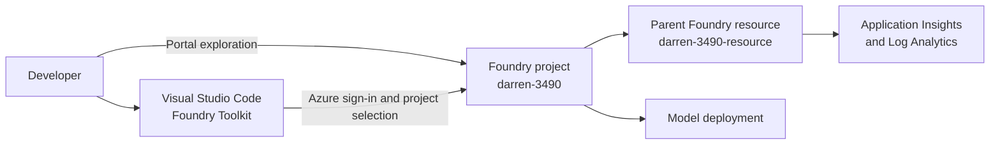

# Prepare for an AI Development Project with Microsoft Foundry

> A foundational Microsoft Foundry environment established in Azure and connected to Visual Studio Code, ready for subsequent generative-AI application development.

## Project status

**Status:** Complete - evidence reconstructed

**Context:** AI Engineering Bootcamp assignment

**Completed:** July 2026

This was a portal and developer-environment setup exercise rather than a standalone coded application. The original completion screenshots and playground transcript were not retained, so this page distinguishes currently verifiable evidence from historical steps that cannot be independently confirmed.

## Objective

The purpose of the exercise was to establish a working Microsoft Foundry development environment and understand how Azure resources, Foundry projects, model deployments, endpoints, and local developer tooling fit together.

The exercise covered:

- creating a Microsoft Foundry project and its parent Azure AI Services resource;
- exploring the model catalog and model deployment workflow;
- testing a generative model through a playground;
- distinguishing resource, project, and Azure OpenAI endpoints; and
- connecting Microsoft Foundry to Visual Studio Code through Foundry Toolkit.

## Architecture

The diagram uses resource names but intentionally omits subscription identifiers, tenant identifiers, identities, keys, and endpoint URLs.

## Verified implementation evidence

The environment was audited in August 2026. The following evidence remains verifiable:

| Requirement | Evidence | Assessment |
|---|---|---|
| Azure access | The course Azure subscription is enabled and accessible through Azure CLI | Verified |
| Development tools | Visual Studio Code, Git, Azure CLI, Azure Developer CLI, and Python 3.13 are installed | Verified |
| Foundry project | `darren-3490` exists and reports successful provisioning | Verified |
| Parent resource | `darren-3490-resource` exists as an Azure AI Services resource | Verified |
| Project relationship | Azure reports `darren-3490` as the default project beneath its parent resource | Verified |
| Region | Project and parent resource are located in East US 2 | Verified |
| Identity | A system-assigned managed identity is configured | Verified, identifiers withheld |
| Monitoring | Supporting Application Insights and Log Analytics resources exist | Verified |
| Project endpoint | A Foundry project endpoint is available | Verified, URL withheld |
| VS Code integration | Foundry Toolkit for VS Code version 1.6.7 is installed | Verified |

Supporting Azure deployment history indicates that the monitoring resources associated with `darren-3490-resource` were provisioned on 22 July 2026 (Australian Eastern Standard Time). A second project, `darren-gen-ai-app`, followed approximately 11 minutes later and was used for the generative chat application assignment.

## Evidence limitation

The exercise required a generative model to be deployed and tested through Foundry and Visual Studio Code playgrounds. A `gpt-5.2` deployment is currently visible in the subsequent `darren-gen-ai-app` project, but no retained evidence separately attributes that deployment or an original playground response to `darren-3490`.

The model test for this first project is therefore recorded as **historically plausible but not independently verified**. It is not presented as fresh evidence of a successful model invocation.

## Endpoint concepts learned

Microsoft Foundry exposes related endpoints for different scopes and APIs:

- **Foundry resource endpoint:** resource-level services and tools shared across projects;
- **Foundry project endpoint:** project-scoped Foundry APIs, models, and agent capabilities; and
- **Azure OpenAI endpoint:** OpenAI-compatible APIs such as Chat Completions and Responses.

This distinction became important in the following chat-application project, where using the correct Azure OpenAI endpoint and exact deployment name was necessary for the client application.

## Developer environment

| Component | Purpose |
|---|---|
| Microsoft Foundry portal | Create and manage projects, models, endpoints, and operations |
| Foundry Toolkit for VS Code | Explore connected Foundry resources and model playgrounds from the editor |
| Azure CLI | Authenticate and inspect Azure context and resources |
| Azure Developer CLI | Support later Foundry development and deployment workflows |
| Python 3.13 | Supported runtime for the Microsoft learning exercises |
| Git and Visual Studio Code | Source control and local development environment |

## Security and responsible use

- Secrets and endpoint URLs are not included in this portfolio.
- Microsoft Entra ID authentication is preferred to embedded API keys where supported.
- Local `.env` files are excluded through the repository `.gitignore`.
- Tenant IDs, subscription IDs, identity IDs, account emails, and keys are deliberately omitted.
- Shared-course credentials are not reused or republished.
- Azure resources should be monitored or removed when they are no longer required to avoid unnecessary cost.

## Key learning

1. A Foundry **project** is not the same thing as its parent Azure AI Services **resource**.
2. The endpoint required by an application depends on the SDK and API being used.
3. A model name and a deployment name are related but not always interchangeable.
4. Microsoft Foundry changes rapidly, so documentation and screenshots should record the date and product surface used.
5. A credible portfolio should preserve working evidence while clearly disclosing gaps in historical evidence.

## Next steps

- Document the generative chat application built in the subsequent project.
- Capture sanitised screenshots for future exercises as work is completed.
- Record model deployment names and tested API surfaces without exposing credentials.
- Continue using Entra ID authentication for local development where the exercise supports it.

## Attribution

This project was completed as part of an AI Engineering Bootcamp using the Microsoft Learning exercise [Prepare for an AI development project](https://microsoftlearning.github.io/mslearn-ai-studio/Instructions/Exercises/01-Explore-ai-studio.html).

The portfolio documentation is an original reconstruction based on the remaining local environment and read-only Azure resource evidence. Microsoft product names and trademarks belong to their respective owners.

## Licence

No project-specific licence has been granted. Unless stated otherwise, this documentation is all rights reserved.
