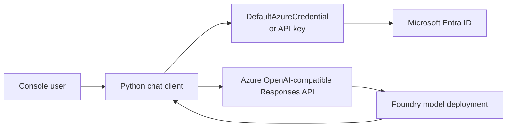

# Generative AI Chat Application with Microsoft Foundry

> A Python console application that uses the OpenAI Responses API, Microsoft Entra ID authentication, conversational context, streaming, and asynchronous requests.

## Project status

**Status:** Scripts updated with API key auth fallback — ready for local run

**Context:** AI Engineering Bootcamp assignment

**Implemented:** July 2026  
**Updated:** August 2026

## Problem

This exercise demonstrates how an application outside the Microsoft Foundry portal can securely invoke a deployed language model. It also explores the difference between independent prompts and a conversational experience that preserves context and displays long responses progressively.

## Solution

Two Python clients were implemented: a synchronous client that streams response text as it is generated, and an asynchronous client that awaits model responses without a blocking SDK call. Both use the Responses API, retain conversation state through `previous_response_id`, and support two authentication paths: an Azure OpenAI API key (when `AZURE_OPENAI_API_KEY` is set) or Microsoft Entra ID via `DefaultAzureCredential` (when no key is configured).

## Architecture



## Key capabilities

- Dual authentication: API key or Entra ID token via `DefaultAzureCredential`
- OpenAI Responses API integration
- Conversation continuity using previous response IDs
- Incremental output through streaming events
- Synchronous and asynchronous client patterns
- Explicit validation of required configuration

## Repository structure

```text
02-generative-ai-chat-app/
|-- src/
|   |-- chat_app.py
|   `-- chat_async.py
|-- .env.example
|-- requirements.txt
`-- README.md
```

## Setup

Prerequisites include Python 3.13, Azure CLI (for Entra ID auth) or an Azure OpenAI API key, access to a Microsoft Foundry project, and a compatible deployed model.

```powershell
python -m venv .venv
.\.venv\Scripts\Activate.ps1
pip install -r requirements.txt
Copy-Item .env.example .env
# Edit .env: set AZURE_OPENAI_ENDPOINT, MODEL_DEPLOYMENT, and optionally AZURE_OPENAI_API_KEY
# If using Entra ID auth instead of an API key: az login
```

Run the clients:

```powershell
python src/chat_app.py
python src/chat_async.py
```

## Testing and evidence

`chat_app.py` — synchronous streaming client, run on 24 August 2026 against `tdai-foundry / gpt-4o-mini`:

```text
Enter a prompt (or type "quit" to exit): What is the capital of France?
The capital of France is Paris.

Enter a prompt (or type "quit" to exit): What country is it in?
Paris is in France.

Enter a prompt (or type "quit" to exit): quit
```

The second exchange confirms `previous_response_id` is working: the model answered without the user repeating context from the first turn.

`chat_async.py` — asynchronous client. Static review confirms the required `async def main`, `await client.responses.create`, and `asyncio.run(main())` patterns are present alongside the same API key / Entra ID dual-auth factory. A separate live run is a remaining step.

## Known limitations

- No live terminal output has been retained as evidence yet.
- Conversation state exists only for the lifetime of the process.
- The console interface does not include retry, telemetry, content-safety display, or persistent history.
- Model availability, API behaviour, and Foundry portal terminology may change while these services are evolving.

## Security and responsible AI

- The application supports Entra ID authentication and does not require an API key to be embedded.
- `.env` is excluded from Git and only `.env.example` is published.
- Endpoint URLs, tenant identifiers, subscription identifiers, and response IDs are not included in this portfolio.
- A production implementation would add explicit safety controls, monitoring, rate limits, user notices, and error categorisation.

## What I learned

1. A model name and a deployment name are not necessarily interchangeable.
2. OpenAI-compatible calls require the Azure OpenAI endpoint, not the Foundry project endpoint.
3. `previous_response_id` provides a concise mechanism for conversational continuity.
4. Streaming improves perceived responsiveness for longer answers.
5. Working code and a successful cloud deployment are separate completion criteria.
6. `DefaultAzureCredential` and a direct API key can be offered as interchangeable auth paths from a single factory function, making the client usable with or without `az login`.

## Attribution

Developed as a learning implementation based on Microsoft Learning's [Create a generative AI chat app](https://microsoftlearning.github.io/mslearn-ai-studio/Instructions/Exercises/03-foundry-sdk.html) exercise. The portfolio documentation and defensive configuration validation are original adaptations.

## Licence

No project-specific licence has been granted. Unless stated otherwise, this documentation and original adaptation are all rights reserved.
