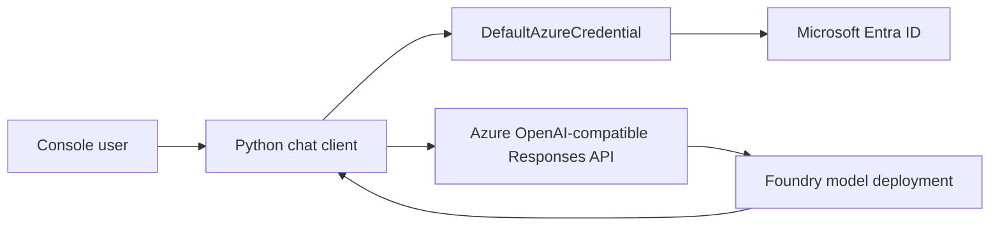

# Generative AI Chat Application with Microsoft Foundry

> A Python console application that uses the OpenAI Responses API, Microsoft Entra ID authentication, conversational context, streaming, and asynchronous requests.

## Project status

**Status:** Implementation complete - live Azure validation pending

**Context:** AI Engineering Bootcamp assignment

**Implemented:** July 2026  
**Audited:** August 2026

## Problem

This exercise demonstrates how an application outside the Microsoft Foundry portal can securely invoke a deployed language model. It also explores the difference between independent prompts and a conversational experience that preserves context and displays long responses progressively.

## Solution

Two Python clients were implemented: a synchronous client that streams response text as it is generated, and an asynchronous client that awaits model responses without a blocking SDK call. Both use the Responses API, retain conversation state through `previous_response_id`, and authenticate through Microsoft Entra ID rather than an embedded API key.

## Architecture



## Key capabilities

- Entra ID token-based authentication
- OpenAI Responses API integration
- conversation continuity using previous response IDs
- incremental output through streaming events
- synchronous and asynchronous client patterns
- explicit validation of required configuration

## Repository structure

```text
02-generative-ai-chat-app/
|-- src/
|   |-- chat_app.py
|   `-- chat_async.py
|-- .env.example
|-- requirements.txt
`-- README.md
```

## Setup

Prerequisites include Python 3.13, Azure CLI, access to a Microsoft Foundry project, and a compatible deployed model.

```powershell
python -m venv .venv
.\.venv\Scripts\Activate.ps1
pip install -r requirements.txt
Copy-Item .env.example .env
az login
```

Update `.env` with the Azure OpenAI endpoint and exact deployment name, then run:

```powershell
python src/chat_app.py
python src/chat_async.py
```

## Testing and evidence

The recovered implementation was compared with the Microsoft Learning exercise in August 2026. Static review confirms that the required synchronous, contextual, streaming, and asynchronous patterns are present.

Live model invocation remains pending. The retained July test reached Azure successfully but returned `DeploymentNotFound`. A read-only Azure audit on 13 August 2026 found no active language-model deployment beneath the intended Foundry resource. This is recorded as a platform/deployment blocker rather than a successful demonstration.

## Known limitations

- No successful model response has yet been retained as evidence.
- Conversation state exists only for the lifetime of the process.
- The console interface does not include retry, telemetry, content-safety display, or persistent history.
- Model availability, API behavior, and Foundry portal terminology may change while these services are evolving.

## Security and responsible AI

- The application uses Entra ID authentication and does not require an API key.
- `.env` is excluded from Git and only `.env.example` is published.
- Endpoint URLs, tenant identifiers, subscription identifiers, and response IDs are not included in this portfolio.
- A production implementation would add explicit safety controls, monitoring, rate limits, user notices, and error categorisation.

## What I learned

1. A model name and a deployment name are not necessarily interchangeable.
2. OpenAI-compatible calls require the Azure OpenAI endpoint, not the Foundry project endpoint.
3. `previous_response_id` provides a concise mechanism for conversational continuity.
4. Streaming improves perceived responsiveness for longer answers.
5. Working code and a successful cloud deployment are separate completion criteria.

## Attribution

Developed as a learning implementation based on Microsoft Learning's [Create a generative AI chat app](https://microsoftlearning.github.io/mslearn-ai-studio/Instructions/Exercises/03-foundry-sdk.html) exercise. The portfolio documentation and defensive configuration validation are original adaptations.

## Licence

No project-specific licence has been granted. Unless stated otherwise, this documentation and original adaptation are all rights reserved.
