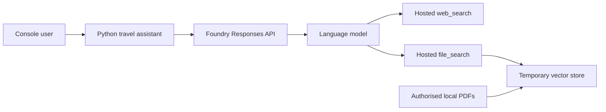

# Generative AI Application with Web and File Search

> A travel-assistant prototype that grounds model responses with current web information and authorised local documents through Foundry-hosted tools.

## Project status

**Status:** Implementation prepared - live Azure validation pending

**Context:** AI Engineering Bootcamp assignment

**Prepared:** August 2026

## Problem

A general-purpose language model can provide broad travel information, but its training data may not contain current events or the services offered by a specific travel company. Useful answers therefore need grounding in both current public information and private organisational documents.

## Solution

The application uses the OpenAI Responses API with two hosted tools:

- `web_search` for current destination information and travel advice; and
- `file_search` for services described in locally supplied travel brochures.

At startup, authorised PDFs from a local `brochures` directory are uploaded to a temporary vector store. The application preserves conversational context while routing retrieval through the model's hosted tools. The temporary vector store is deleted when the application exits.

## Architecture



## Key capabilities

- current-information retrieval through hosted web search
- document grounding through hosted file search
- vector-store creation and batch document upload
- conversational continuity using previous response IDs
- Entra ID authentication without embedded API keys
- automatic cleanup of the vector store created by the application

## Repository structure

```text
03-generative-ai-tools-app/
|-- src/
|   `-- tools_app.py
|-- brochures/             # local, authorised PDFs; not committed
|-- .env.example
|-- requirements.txt
`-- README.md
```

## Setup

Create an environment, install dependencies, and sign into Azure:

```powershell
python -m venv .venv
.\.venv\Scripts\Activate.ps1
pip install -r requirements.txt
Copy-Item .env.example .env
az login
```

Update `.env` with the Azure OpenAI endpoint and exact model deployment name. Create a local `brochures` directory containing PDFs you are authorised to use, then run:

```powershell
python src/tools_app.py
```

Representative test sequence:

1. `What's happening in San Francisco next month?`
2. `What hotels does Margie's Travel offer there?`

The first answer should use current web information. The follow-up should combine retained context with information retrieved from the brochures.

## Testing and evidence

Static validation and live Azure testing are pending. The intended model deployment was not active when the project was audited on 13 August 2026, so no successful tool invocation is claimed yet.

Evidence to capture after deployment:

- successful vector-store upload count;
- a sanitised answer that uses `web_search`;
- a follow-up answer grounded through `file_search`;
- confirmation that the temporary vector store was deleted; and
- a screenshot that excludes endpoint, tenant, subscription, and identity details.

## Design decisions

- Entra ID is used instead of API-key authentication.
- Course brochure PDFs are not redistributed in this repository.
- File handles are managed with `ExitStack` to ensure they close after upload.
- A vector store created by this demo is deleted on exit to avoid accumulating unused resources.
- Configuration validation produces clear errors before an API call is attempted.

## Known limitations

- The application has not yet been validated against a live model deployment.
- Hosted tool support can vary by model, region, API version, and service rollout.
- Web results and model answers are non-deterministic and require source-aware user judgement.
- The console prototype does not expose citations, tracing, retry logic, or a persistent conversation store.
- Cleanup may require manual action if the process is forcibly terminated before the `finally` block runs.

## Security and responsible AI

- No credentials, endpoint URLs, private PDFs, or generated vector-store identifiers are committed.
- Users should only upload documents they are authorised to process.
- Web-derived claims should be checked against the cited primary source before consequential use.
- Production use would require content safety, logging controls, retention rules, access controls, rate limits, and human oversight.

## What I learned

1. Tools can ground a model in sources beyond its training data.
2. Web search and file search solve different freshness and specificity problems.
3. Conversation state helps a follow-up question connect current information with company documents.
4. Temporary AI resources need an explicit lifecycle and cleanup strategy.
5. A working retrieval pipeline still requires evaluation of answer quality and source use.

## Attribution

Developed as a learning implementation based on Microsoft Learning's [Create a generative AI app that uses tools](https://microsoftlearning.github.io/mslearn-ai-studio/Instructions/Exercises/04a-use-own-data.html) exercise. Microsoft-provided brochure PDFs are intentionally not redistributed.

## Licence

No project-specific licence has been granted. Unless stated otherwise, this documentation and original adaptation are all rights reserved.
