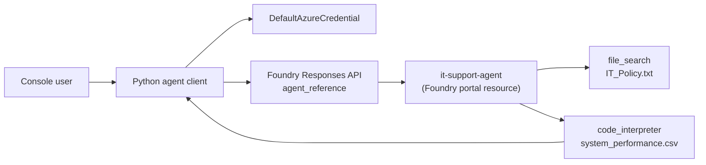

# IT Support Agent with Foundry Grounding Tools

> A console client for a Microsoft Foundry-hosted agent that answers IT policy questions and analyses system performance data using file search and code interpreter.

## Project status

**Status:** Implementation prepared - Foundry agent creation and live validation blocked

**Context:** AI Engineering Bootcamp assignment (Homework 4)

**Prepared:** August 2026

## Problem

A support agent needs to answer policy questions from an internal document and reason over operational data, not just hold a general conversation. The exercise asks for a Foundry-hosted agent, configured once with grounding data and tools, that multiple client surfaces (portal, VS Code, custom app) can reuse consistently.

## Solution

The design has two parts, matching the exercise:

1. **The agent itself** - a named "prompt agent" (`it-support-agent`) created and configured in the Foundry portal, with `file_search` grounded on an IT policy document and `code_interpreter` grounded on a system-performance CSV. This is a one-time, portal-side configuration step, not application code.
2. **This client** (`src/agent_app.py`) - a console chat loop that calls the agent by name through the Responses API's `agent_reference` mechanism, rather than talking to a raw model deployment. It preserves conversation context with `previous_response_id` and saves any chart images the agent's code interpreter generates to a local `agent_outputs/` folder.

## Architecture



## Key capabilities

- calls a pre-configured Foundry agent by name instead of a raw model
- conversation continuity using `previous_response_id`
- defensive parsing of response output items (text and code-interpreter chart output)
- generated charts saved locally to `agent_outputs/`
- Entra ID authentication, no embedded API key

## Repository structure

```text
04-ai-agent/
|-- src/
|   `-- agent_app.py
|-- .env.example
|-- requirements.txt
`-- README.md
```

## Setup

### 1. Create the agent in the Foundry portal (one-time, portal-side)

1. Open `https://ai.azure.com`, create or select a project.
2. Create an agent named `it-support-agent` with instructions to act as an IT support agent for a fictional organisation.
3. Add the `file_search` and `code_interpreter` tools.
4. Download and upload the two grounding files supplied by the exercise: `IT_Policy.txt` and `system_performance.csv` (from the [MicrosoftLearning/mslearn-ai-agents Labfiles](https://github.com/MicrosoftLearning/mslearn-ai-agents/tree/main/Labfiles/01-build-agent-portal-and-vscode) - not redistributed in this repository).
5. Save the agent and copy the project endpoint.

### 2. Run the client

```powershell
python -m venv .venv
.\.venv\Scripts\Activate.ps1
pip install -r requirements.txt
Copy-Item .env.example .env
az login
```

Update `.env` with the project endpoint and agent name, then:

```powershell
python src/agent_app.py
```

Representative test sequence:

1. `What's the policy for password resets?` - should cite the policy document.
2. `Analyze the system performance data and tell me if there are any concerning trends.` - should trigger code interpreter analysis.
3. `Create a chart showing CPU usage over time.` - should save a PNG to `agent_outputs/`.

## Testing and evidence

Not yet executed against a live agent. Creating the underlying agent requires selecting a deployed language model in the Foundry portal, and no language-model deployment currently succeeds in the target resource - see [AZURE_PLATFORM_BLOCKER.md](../AZURE_PLATFORM_BLOCKER.md). This project is therefore blocked one step upstream of Homework 2/3: the client code is written, but the agent it depends on cannot yet be created.

## Design decisions

- The client calls the agent by name (`agent_reference`) rather than embedding the agent's instructions and tools in application code, matching the exercise's "reusable, centrally-configured agent" intent.
- Response-item parsing is defensive (`getattr` with fallbacks) because the Responses API's agent support is actively evolving and the exact output-item shape was not verifiable without a live response to inspect.
- Grounding files are referenced by their public source URL, not committed, consistent with this repository's policy on course-supplied content.

## Known limitations

- No live response has been captured; the `format_output_text` parsing logic is unverified against a real payload.
- The agent's own configuration (instructions, tools, grounding files) lives in the Foundry portal and is not itself version-controlled here.
- No retry, streaming, or citation-source display is implemented.

## Security and responsible AI

- Entra ID authentication via `DefaultAzureCredential`; no API key.
- `.env` is excluded from Git.
- Project endpoint, subscription, and tenant identifiers are not included in this portfolio.
- The IT policy and performance grounding files are course-supplied sample data, not real organisational data.

## What I learned

1. A Foundry "prompt agent" is a persisted, named resource distinct from calling a model directly - the client references it, it doesn't define it.
2. `agent_reference` in the Responses API's `extra_body` is the current mechanism for calling a named agent, replacing the older Assistants API pattern.
3. An agent's tools and grounding data are configured once and reused across every client surface (portal, VS Code, custom app).
4. A blocked prerequisite (model deployment) can block an entire chain of downstream exercises, not just the one it directly affects.

## Attribution

Developed as a learning implementation based on Microsoft Learning's [Build AI agents with portal and VS Code](https://microsoftlearning.github.io/mslearn-ai-agents/Instructions/Exercises/01-build-agent-portal-and-vscode.html) exercise. Grounding files (`IT_Policy.txt`, `system_performance.csv`) are Microsoft-supplied course material and are not redistributed here.

## Licence

No project-specific licence has been granted. Unless stated otherwise, this documentation and original adaptation are all rights reserved.
