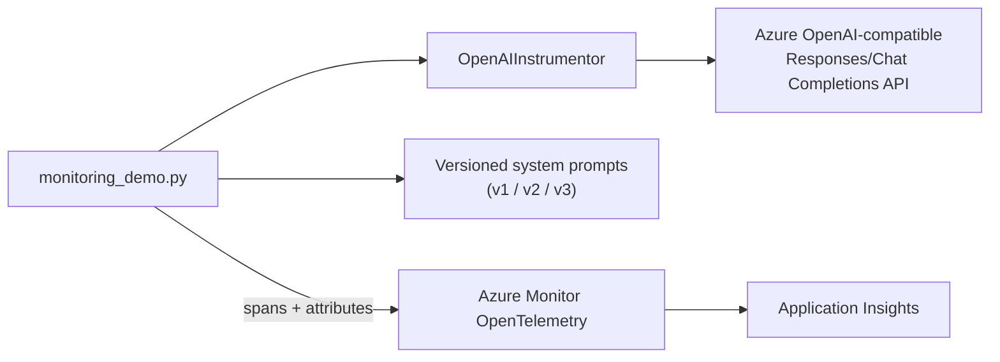

# Prompt-Version Monitoring and Tracing

> A single-script OpenTelemetry demonstration that compares token usage and latency across three system-prompt versions for a trail-guide assistant.

## Project status

**Status:** Implementation prepared - live Azure validation pending

**Context:** AI Engineering Bootcamp assignment (Homework 5)

**Prepared:** August 2026

## Problem

Prompt engineering trades off verbosity, cost, and latency, but that trade-off is invisible without instrumentation - a shorter prompt might produce a cheaper, faster, equally useful answer, or it might just be worse. This exercise measures the difference directly instead of guessing.

## Solution

`src/monitoring_demo.py` runs the same three representative test questions against three versions of a trail-guide system prompt (`v1`: exhaustive and unconstrained, `v2`: focused with limited elaboration, `v3`: minimal), instrumented with:

- `azure-monitor-opentelemetry` to export spans and metrics to Application Insights, and
- `opentelemetry-instrumentation-openai-v2` to auto-instrument the underlying Chat Completions calls.

Each prompt version runs inside a root span (`trail_guide_v1`, etc.), with each test question in a child span carrying custom `response.total_tokens` and `response.duration_s` attributes, so duration and token cost are comparable per test and per version.

This is a deliberately simplified, single-file adaptation of the exercise's scaffolded lab repository (which deploys its own Azure infrastructure via `azd up` and includes a separate local trace-tree viewer script). Here, trace inspection happens through Application Insights directly rather than a bespoke local query tool - see [Known limitations](#known-limitations).

## Architecture



## Key capabilities

- OpenTelemetry auto-instrumentation of OpenAI SDK calls
- custom span attributes for token count and latency per test
- root-span-per-prompt-version structure for easy comparison
- externalised, file-based prompt versions (no code change needed to add a v4)

## Repository structure

```text
05-agent-monitoring-tracing/
|-- src/
|   |-- monitoring_demo.py
|   `-- prompts/
|       |-- v1_system_prompt.txt
|       |-- v2_system_prompt.txt
|       `-- v3_system_prompt.txt
|-- .env.example
|-- requirements.txt
`-- README.md
```

## Setup

```powershell
python -m venv .venv
.\.venv\Scripts\Activate.ps1
pip install -r requirements.txt
Copy-Item .env.example .env
az login
```

Update `.env` with the Azure OpenAI endpoint, model deployment name, and the target Foundry project's Application Insights connection string (Foundry portal > project > Monitoring), then:

```powershell
python src/monitoring_demo.py
```

Nine calls run in total (3 questions x 3 versions). Compare total token count, prompt vs. completion token ratio, and duration across versions in Application Insights under **Monitoring > Resource usage**.

## Testing and evidence

Not yet executed. This exercise depends on a working language-model deployment in the target Foundry resource, which is currently blocked - see [AZURE_PLATFORM_BLOCKER.md](../AZURE_PLATFORM_BLOCKER.md). The instrumentation and span structure have been reviewed statically against the `opentelemetry` and `azure-monitor-opentelemetry` package documentation but not exercised against a live trace.

## Known limitations

- No live trace has been captured or compared yet.
- Unlike the source exercise's scaffolded repository, this adaptation does not reproduce a local trace-tree viewer (`check_traces.py`) - trace inspection is expected to happen in Application Insights instead.
- No Azure Monitor alert rule is configured (the exercise lists this as an optional extension).
- The three prompt versions and test questions are original, written to match the exercise's intent (compare verbosity/cost/latency trade-offs), not copied from the source repository.

## Security and responsible AI

- Entra ID authentication via `DefaultAzureCredential`; no API key.
- `.env`, including the Application Insights connection string, is excluded from Git.
- Telemetry sent to Application Insights includes prompts and token counts; production use would need a data-retention and access-control review before sending real user content through this pipeline.

## What I learned

1. Prompt length has a direct, measurable cost in tokens and latency, not just a qualitative "more thorough" trade-off.
2. OpenTelemetry auto-instrumentation can capture LLM call spans without manually wrapping every API call.
3. Custom span attributes turn generic tracing into a structured A/B comparison tool.
4. Observability is itself a testable exercise output, not just an operational afterthought.

## Attribution

Developed as a learning implementation based on Microsoft Learning's [Monitor and trace your generative AI agent](https://microsoftlearning.github.io/mslearn-genaiops/docs/05-monitoring-tracing.html) exercise. The source exercise's full scaffolded repository (Azure infrastructure-as-code, `trail_guide_agent` package, `check_traces.py`) is not reproduced here; this is an original, simplified single-script adaptation of its core tracing concept.

## Licence

No project-specific licence has been granted. Unless stated otherwise, this documentation and original adaptation are all rights reserved.
