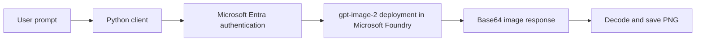

# Generate Images with AI

> Shared portfolio evidence for **DAX AI Engineering Bootcamp Assignment 7** and **Microsoft AI-103 Exercise 4.2**.

## Overview

This project demonstrates text-to-image generation with Microsoft Foundry, the `gpt-image-2` model, Microsoft Entra authentication, and the OpenAI Python SDK. A command-line client accepts natural-language prompts, generates images through an Azure-hosted model deployment, decodes the returned base64 data, and saves each result as a PNG file.

The exercise was validated live on 20 August 2026. No API key is stored in the project.

## Result

The client successfully generated the required learning example and an original transport-operations concept for My Lane.

### Transport control tower


Prompt:

> Create a professional isometric illustration of an Australian transport control tower monitoring trucks, delivery routes, safety alerts, and supply-chain performance. Use a clean blue and teal palette with no text, brands, or logos.

### Robot eating pizza


Prompt:

> Create an image of a robot eating pizza.

## Solution flow



## Azure configuration

| Item | Value |
|---|---|
| Foundry project | `darren-image-generation-se` |
| Region | Sweden Central |
| Model | `gpt-image-2` |
| Model version | `2026-04-21` |
| Deployment type | Global Standard |
| Authentication | Microsoft Entra ID through `DefaultAzureCredential` |

The first project was created in East US 2, but all four image-generation requests per minute available to the shared subscription were already allocated. Existing shared deployments were left unchanged. A read-only capacity and quota check identified Sweden Central with 0 of 4 RPM in use, so a new project was created there and validated successfully.

## Run locally

### Prerequisites

- Python 3.13
- Azure CLI
- access to the Azure subscription containing the model deployment
- an active `gpt-image-2` deployment

### Setup

1. Create and activate a virtual environment.
2. Install the dependencies:

   ```powershell
   python -m pip install -r requirements.txt
   ```

3. Copy `.env.example` to `.env` and add the Azure OpenAI v1 endpoint and deployment name.
4. Sign in to Azure:

   ```powershell
   az login
   ```

5. Run the client:

   ```powershell
   python image-client.py
   ```

Generated files are saved in an `images` directory under the current working directory.

## Security

- The portfolio contains `.env.example` with placeholders only.
- The working `.env` file is not included.
- No API key, access token, subscription ID, or tenant ID is published.
- Runtime authentication uses the signed-in Azure identity.

## Lessons learned

- Model availability and subscription quota are separate checks: a model can appear in the catalog while the selected region has no allocatable quota.
- Shared subscription allocations must not be reduced without authorization from their owners.
- A Global Standard deployment remains pay-per-use; it does not reserve provisioned throughput.
- Image responses can be returned as base64 data and decoded directly into local PNG files.
- Generated output should be reviewed for accuracy, unwanted text, brand elements, and other artifacts before use.

## Limitations and next steps

- The sample counter resets whenever the process restarts, so default filenames can be overwritten. A production version should use timestamps or unique identifiers.
- The command-line client does not retain prompt history.
- Future work could add prompt metadata, cost telemetry, image-size controls, content review, and a lightweight web interface.

## Attribution

Adapted from Microsoft Learning's [Generate images with AI](https://microsoftlearning.github.io/mslearn-ai-vision/Instructions/Exercises/02-generate-image.html) exercise and the [`mslearn-ai-vision`](https://github.com/MicrosoftLearning/mslearn-ai-vision) starter repository. The Azure setup, completed code sections, prompts, generated outputs, troubleshooting notes, and portfolio documentation are the learner's work.
