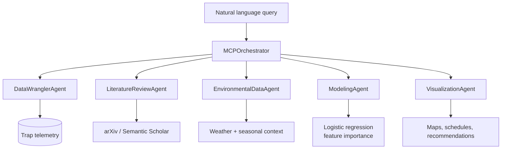

# Multi-Agent Analytics Framework for Conservation Pest Control

> An MCP-style multi-agent architecture built over 1.36 million IoT trap-telemetry records, combining regulatory-grade data cleaning, dynamic literature retrieval, and interpretable modelling for a New Zealand conservation technology company.

📄 **Not a developer?** The [written progress report (PDF, 13 pages)](docs/Future-Proofing-Pest-Control-Progress-Report.pdf) explains the problem, approach, and findings in plain prose.

## Project status

**Status:** Complete - submitted capstone, analysis run against the full real dataset; agent framework demonstrated on synthetic data

**Context:** QUT IFQ721 Data Analytics Capstone (Assignment 3), September 2025

## What is real, and what is simulated

The report and the notebook cover two related but distinct pieces of work, and it matters which is which:

| Component | Status |
|---|---|
| Data cleaning, EDA, feature engineering | **Real** - executed against the full 1.36M-record telemetry dataset |
| Balanced logistic regression + leakage removal | **Real** - trained and evaluated on the real data |
| Literature search tool (arXiv + Semantic Scholar + Gradio) | **Real** - working API integrations, cell 30 |
| MCP agent architecture (base class, five agents, orchestrator) | **Real code**, but demonstrated on generated data |
| `EnvironmentalDataAgent` weather feed | **Simulated** - `np.random` distributions standing in for a weather API |
| `LiteratureReviewAgent` inside the orchestrator | **Stubbed** - the working implementation exists separately in cell 30 but is not wired into the orchestrator |
| Orchestrator end-to-end demo run | **Synthetic** - `np.random.seed(42)`, generated coordinates and event types |

The report states that the MCP architecture "successfully processed the complete 1.36 million record dataset." That is worth reading precisely: the **analysis** of the full dataset was real and is in cells 1-27; the **orchestrated agent pipeline** was demonstrated separately on synthetic data. The architecture is genuine and runnable, but it was not the thing that produced the headline findings.

## Problem

Goodnature is a New Zealand conservation pest-control company whose automated traps emit telemetry across remote deployments. The raw dataset is large but thin on context: irregular time series with substantial gaps, uneven geographic coverage, and no environmental variables - despite pest behaviour being strongly driven by weather, season, and habitat.

It was also collected during COVID-era conditions, when altered human activity may have shifted pest behaviour in ways that will not generalise. Any analysis that ignores that risks drawing confident conclusions from an unrepresentative period.

The brief was therefore not "what happened?" but "what architecture would let this organisation keep answering that question as conditions change?"

## Solution

A modular agent architecture where each concern is a separate, independently testable component:

- **`DataWranglerAgent`** - cleaning, timestamp normalisation, and derived features (trap freshness, hour/day/month, hotspot classification by activity quantile)
- **`LiteratureReviewAgent`** - retrieval of external research to validate empirical findings against published domain knowledge
- **`EnvironmentalDataAgent`** - spatial and temporal joining of weather and seasonal context onto trap events
- **`ModelingAgent`** - interpretable models in preference to maximum-accuracy black boxes
- **`VisualizationAgent`** - translation of statistical output into operational recommendations
- **`MCPOrchestrator`** - workflow coordination, data flow, and graceful degradation when an agent fails

All five inherit from an abstract `MCPAgent` base class exposing a single `process()` contract, which is what makes agents independently replaceable.

## Architecture



## Key capabilities

- abstract base class with a uniform `process()` contract across all agents
- derived-feature engineering: trap freshness, temporal cycles, activity-quantile hotspot flags
- target-leakage detection and a documented re-run with leaky features removed
- working literature retrieval against arXiv and Semantic Scholar with retry handling and optional LLM summarisation
- interpretable modelling chosen deliberately over higher-accuracy opaque alternatives
- fault-tolerant orchestration with graceful degradation

## Repository structure

```text
qut-data-analytics-capstone/
|-- docs/
|   `-- Future-Proofing-Pest-Control-Progress-Report.pdf   # written report (start here)
|-- notebooks/
|   `-- goodnature_mcp_analysis.ipynb                      # 34 cells, outputs retained
`-- README.md
```

## Running it

The notebook is published **as submitted**, so it retains its original Colab structure and reads data from a mounted Drive path (`/content/drive/MyDrive/Capstone QUT`). To run it elsewhere, adjust the path constants in the first cells.

The source telemetry is **not included in this repository** - see below.

Dependencies (installed inline in the notebook): `pandas`, `numpy`, `scikit-learn`, `matplotlib`, `seaborn`, `arxiv`, `gradio`, `tenacity`, `requests`. The optional LLM summarisation path reads `OPENAI_API_KEY` from the environment and is skipped when unset.

## Testing and evidence

Cell outputs are retained in the notebook as evidence of execution: EDA summaries, distribution plots, model coefficients, and feature-importance rankings.

The most instructive result is negative. An initial balanced logistic regression produced suspiciously strong performance; inspection identified target leakage in the feature set, and the model was re-run without the leaking features (cell 25, *"Re-run: Balanced logistic regression WITHOUT leaky features"*). The corrected model is weaker and more honest. Finding this mattered more than the accuracy figure would have.

## Known limitations

- The orchestrated pipeline has never run end to end on the real dataset; its demo uses synthetic data.
- Weather integration is simulated. Real feeds bring latency, station sparsity, and micro-climate variance that this design does not yet address.
- The working literature-search tool is not wired into the orchestrator's `LiteratureReviewAgent`.
- Findings derive from COVID-period data and may not generalise to current conditions.
- Coverage is biased toward conservation areas, limiting transfer to urban or agricultural settings.
- Predictive figures quoted in the report should be read as capstone-stage results, not validated production benchmarks.

## What I learned

1. Target leakage produces exactly the result you were hoping for, which is why it survives unexamined - the suspiciously good model deserves more scrutiny than the disappointing one.
2. An agent architecture can be structurally sound and still be demonstrating on synthetic inputs; those are separate claims and should be documented separately.
3. Interpretability was worth more than accuracy here, because the audience needed to act on the reasoning rather than trust a score.
4. Context absent from a dataset can matter more than what is in it - the environmental variables and the COVID-period caveat shaped the conclusions more than any modelling choice.
5. Modularity paid off in testing, not just in design: each agent could be exercised independently before integration.

## Data, attribution, and permissions

The underlying telemetry belongs to **Goodnature** and was made available for this QUT capstone unit. **No dataset files are included in this repository** and none should be added.

The report contains aggregate operational findings derived from that data. It is published here as academic coursework; if Goodnature or QUT require its removal or restriction, it will be withdrawn on request.

Completed as assessed coursework for QUT IFQ721 (Unit Coordinator: Dr Yaping Zhu). Claude (Anthropic) was used during development and is cited as a tool in the report's reference list.

## Licence

No project-specific licence has been granted. Unless stated otherwise, this documentation and the original implementation are all rights reserved. The underlying data and any rights in it remain with Goodnature.
