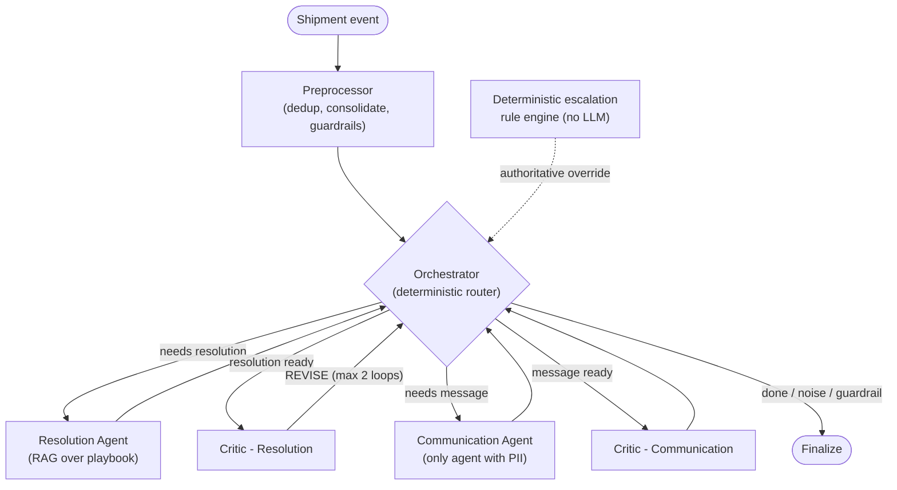

# Multi-Agent Last-Mile Delivery Exception Handler

> A LangGraph multi-agent system that automates end-to-end delivery exception handling — classifying the exception, resolving it against an operations playbook via RAG, drafting the customer message, and validating both decisions through a critic before anything reaches a customer.

## Project status

**Status:** Complete - working POC, evaluated against 10 end-to-end test cases with results retained in the notebook

**Context:** Final project, UT Austin Post-Graduate Program in AI Agents for Business Applications (2026), delivered via Great Learning

## Problem

Roughly 10% of last-mile shipments hit a delivery exception - a failed attempt, damage, a weather delay, a refused package. Each one needs three decisions made correctly and quickly: what actually happened (exception classification), what to do about it (a resolution consistent with company policy), and how to tell the customer (a message matching their tier and the situation). Get any one wrong and it becomes a complaint instead of a routine event.

Doing this by hand doesn't scale, and doing it with a single LLM call risks policy violations with no audit trail and no way to guarantee the highest-stakes cases - a VIP customer's third failed attempt, a damaged perishable - are actually escalated rather than left to a model's judgment.

## Solution

A LangGraph pipeline with six nodes, each with a narrow, enforced scope:

1. **Preprocessor** - deduplicates scan events, consolidates multi-row shipments into a single event, scans free-text driver/handler notes for prompt injection, and flags routine "noise" so it can skip the LLM entirely.
2. **Orchestrator** - a deterministic router (no LLM) that reads state and decides which node runs next, based on an explicit 10-step priority order covering guardrails, revision loops, and the escalation rule engine.
3. **Resolution Agent** - classifies the exception and proposes a resolution, grounded in the operations playbook via RAG.
4. **Critic (resolution)** - validates the resolution against the playbook and ground rules; can send it back for revision (capped at 2 loops).
5. **Communication Agent** - drafts the customer-facing message. The only agent with access to the customer's name.
6. **Critic (communication)** - validates tone, content, and resolution-consistency before a message is considered approved.

Running underneath all of this, independent of any LLM: a **deterministic escalation rule engine** that evaluates hard-coded triggers (VIP with 3+ exceptions in 90 days, third failed attempt, damaged perishables, perishable weather delays over 4 hours, address patterns suggesting fraud) so the highest-stakes cases can never be talked out of escalating by an LLM.

## Architecture



Every node reads and writes through a **typed view** of a shared state object, not the raw state itself - see [Key capabilities](#key-capabilities).

## Key capabilities

- **Data isolation by construction, not convention.** Five typed dataclass "views" (`RouterView`, `ResolutionAgentView`, `CommunicationAgentView`, `CriticResolutionView`, `CriticCommunicationView`) define exactly which state fields each node can read and write. `project_into()` filters state down to a node's view before it runs; `merge_back()` writes back only the fields that view owns. The customer's name (`customer_profile_full`) is typed into `CommunicationAgentView` alone - every other node only ever sees the redacted `customer_profile`.
- **A deterministic rule engine sits outside the LLM's authority.** Escalation triggers are hard-coded and evaluated in plain Python; the orchestrator treats the rule engine's output as authoritative, so no prompt or model behaviour can suppress a required escalation.
- **Prompt-injection scanning on free-text fields** before any LLM call, with a hard stop that forces escalation rather than silently continuing.
- **RAG over an operations playbook** (10-page PDF, chunked and embedded into Chroma) grounds the Resolution Agent's decisions in actual policy rather than general knowledge.
- **A revision loop with a hard cap.** The resolution critic can send work back for one or two revisions, then the loop terminates and forces escalation rather than looping indefinitely.
- **Full observability via LangSmith** - every node is `@traceable`, giving a complete trace of tool calls and reasoning per shipment.
- **A five-metric evaluation harness**, including an LLM-as-judge coherence score, run end-to-end across 10 designed test cases (see below).

## Repository structure

```text
delivery-exception-agent/
|-- notebooks/
|   `-- delivery_exception_agent.ipynb   # full pipeline, evaluation harness, results retained
|-- data/
|   |-- customers.db                     # synthetic - 12 customers, 6 lockers
|   |-- delivery_logs.csv                # synthetic - 13 rows, 10 shipments
|   |-- ground_truth.csv                 # expected outcomes for evaluation
|   `-- exception_resolution_playbook.pdf  # fictional 10-page ops manual
|-- config.example.json
|-- requirements.txt
`-- README.md
```

## Setup

```powershell
python -m venv .venv
.\.venv\Scripts\Activate.ps1
pip install -r requirements.txt
Copy-Item config.example.json config.json
```

Add your OpenAI and LangSmith keys to `config.json` (git-ignored - never commit this file), then run `notebooks/delivery_exception_agent.ipynb` top to bottom. It loads `data/` relative to the notebook, builds the Chroma vector store from the playbook on first run, compiles the LangGraph workflow, and executes all 10 test cases.

## Testing and evidence

Results below are the actual output of the notebook's evaluation cell, retained in the published notebook:

| Metric | Result |
|---|---|
| Task Completion Rate | 9/10 (90%) |
| Exception ID Accuracy | 10/10 (100%) |
| Resolution Accuracy | 9/10 (90%) |
| Tone Accuracy | 10/10 (100%) |
| Escalation Accuracy | 6/8 (75%, noise cases excluded) |
| Tool Call Accuracy | 10/10 (100%) |
| Avg Coherence Score (LLM-as-judge) | 4.30 / 5.0 |
| Avg End-to-End Latency | 5.95s (min 0.01s / max 10.71s) |

Ten test cases were purpose-built to exercise specific paths: noise filtering, VIP multi-attempt handling, address-not-found, damaged perishable with VIP escalation, mandatory third-attempt escalation, refused delivery, weather-delay threshold logic, discretionary escalation on exception history, and a second noise-filtering case.

Two failure modes were identified and are documented in the notebook rather than smoothed over:

- **SHP-005 (resolution divergence):** the system correctly identified the target locker as full and chose a conservative RESCHEDULE; ground truth expected REROUTE_TO_LOCKER with a supervisor flag for an alternative. The reasoning was sound but not the ideal path.
- **SHP-003 & SHP-006 (false-positive escalations):** the deterministic rule engine correctly did not fire, but the Critic applied a conservative escalation bias on first-occurrence, standard-tier exceptions. Operationally this is the safer failure direction (over-escalating beats missing a genuine issue), but the Critic's criteria could be tightened.

## Known limitations

- Evaluated on 10 synthetic test cases against a small synthetic dataset (12 customers, 6 lockers) - not production traffic.
- The rule engine and locker inventory are scoped to a single depot region (zip codes 10001-10006); multi-region deployment needs parameterised thresholds per region SLA.
- The playbook's more ambiguous sections (e.g. "use your judgement" for borderline weather delays) produced the most Critic revision cycles - fuzzy policy language increases retrieval and reasoning variance.
- Latency varies widely (0.01s-10.71s) depending on how many nodes and revision loops a given shipment triggers.
- No production integration exists; recommended next step is a shadow-mode pilot alongside the existing manual workflow.

## Security and responsible AI

- API credentials load from a git-ignored `config.json`; only `config.example.json` (placeholders) is committed.
- PII access is restricted by type system, not just prompt instruction - the customer's name is structurally unreachable to every node except the Communication Agent.
- Free-text input fields are scanned for prompt-injection patterns before any LLM call, with a guardrail that forces human escalation rather than proceeding.
- The highest-stakes decisions (VIP repeat exceptions, damaged perishables, fraud-pattern addresses) are enforced by deterministic code, not left to model judgement.
- All data is synthetic - fictional customers, fictional addresses, a fictional operations playbook. No real customer, shipment, or company data is used or included.
- This is a proof-of-concept. It has not been connected to a live dispatch system and should not be treated as production-ready without the shadow-mode validation described above.

## What I learned

1. Isolating data access through typed views closes a whole class of "the LLM saw something it shouldn't have" bugs at the type level, before a prompt is ever written.
2. A deterministic rule engine that the orchestrator treats as authoritative is worth more than a well-crafted prompt for the decisions that must never be wrong - the model can still reason about everything else.
3. A capped revision loop needs an explicit exit path (forced escalation), or a disagreement between agent and critic can loop indefinitely.
4. The two real failures were both interpretable and instructive, not random - a resource-availability edge case and a Critic that erred safely-but-conservatively. Understanding *why* a system fails matters more than the headline pass rate.
5. Fuzzy policy language is a measurable cost: the playbook's vaguest sections produced the most revision cycles, which makes "tighten the wording" a concrete, testable engineering recommendation rather than a vague suggestion.

## Attribution

Completed as the final project for the **UT Austin Post-Graduate Program in AI Agents for Business Applications** (delivered via Great Learning), 2026. The business scenario, dataset, and operations playbook were supplied as fictional course material for the assignment; all data is synthetic.

## Licence

No project-specific licence has been granted. Unless stated otherwise, this documentation and the original implementation are all rights reserved.
