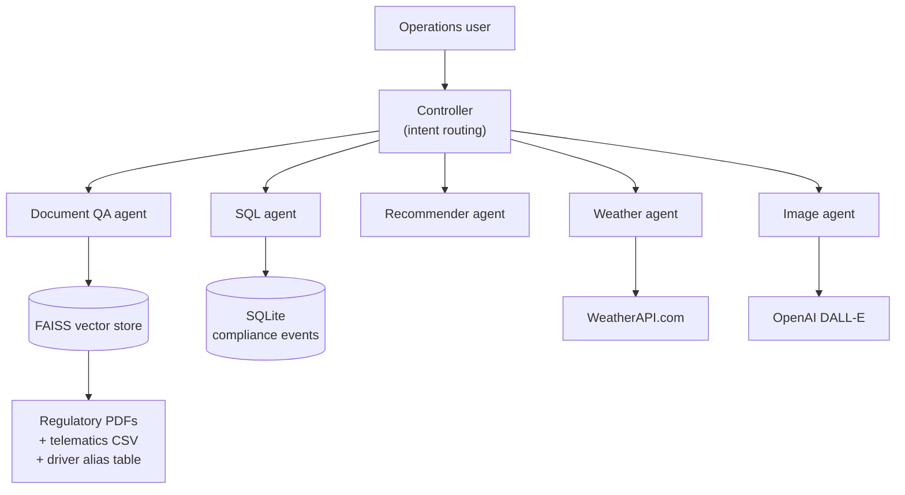

# Multi-Agent AI for Transport Chain of Responsibility Compliance

> A prototype operations assistant that answers Chain of Responsibility questions from official regulatory documents, cross-references driver telematics, and routes specialised tasks through a multi-agent controller.

## Project status

**Status:** Working prototype - runs end to end on simulated telematics with real regulatory source documents

**Context:** My Lane project, originally developed as a Generative AI capstone (NUS, July 2025)

**Built:** June - July 2025
**Documented for portfolio:** August 2026

### What is real, and what is simulated

This distinction matters more than the feature list, so it is stated up front:

| Component | Status |
|---|---|
| Regulatory document retrieval (RAG) | **Real** - runs against official Australian heavy-vehicle publications |
| Multi-agent routing and agent implementations | **Real** - working code, executed outputs retained in the notebooks |
| Weather integration | **Real** - live WeatherAPI.com calls |
| Image generation | **Real** - live DALL-E calls |
| Driver telematics feed | **Simulated** - 20 fictional drivers, generated CSV, no live fleet integration |
| Compliance event database | **Simulated** - local SQLite seeded with sample events |

The system has never been connected to a production fleet or telematics provider. It demonstrates the pipeline and reasoning approach, not an operating compliance monitor.

## Problem

Chain of Responsibility law makes every party in the transport supply chain - not just the driver - legally accountable for safety breaches involving fatigue, speed, mass, dimension, and load restraint. In practice, the obligation is hard to discharge because the relevant information lives in three disconnected places:

- **Regulations**: long PDF publications that are hard to search under time pressure and are periodically superseded;
- **Operational data**: telematics feeds showing driving hours, speed events, and mass readings; and
- **Local context**: weather, route, and site conditions affecting the risk of a given movement.

An operations manager asking "can this driver legally start at 6 AM tomorrow?" needs all three at once. Static dashboards report what already happened; they do not answer that question.

## Solution

A conversational assistant with a central controller that routes each request to a specialised agent:

- **Document QA (RAG)** - retrieves from official regulatory PDFs and answers with regulatory grounding;
- **SQL agent** - queries a compliance-event database by event type and location;
- **Recommender agent** - returns fatigue, speeding, and load-safety guidance;
- **Weather agent** - fetches live conditions for a location; and
- **Image agent** - generates safety signage and scenario visuals via DALL-E.

Driver telematics are loaded alongside the regulatory corpus, with an alias-resolution layer mapping telematics driver IDs to operator names so a natural-language question ("was Maria over the limit on Wednesday?") resolves against ID-keyed data.

## Architecture



## Key capabilities

- retrieval-augmented answers grounded in current Australian regulatory publications
- fusion of unstructured regulation with structured telematics in a single retrieval corpus
- alias resolution so natural-language driver references resolve to telematics IDs
- intent-based routing across five specialised agents behind one conversational entry point
- structured compliance-event querying returned as readable tables
- scenario image generation for safety communication material

## Repository structure

```text
transport-cor-multi-agent/
|-- notebooks/
|   |-- cor_transport_assistant.ipynb      # the integrated system (headline)
|   |-- 01_weather_agent.ipynb             # precursor: single-agent + function calling
|   |-- 02_sql_agent.ipynb                 # precursor: natural language to SQL
|   `-- 03_multi_agent_coordinator.ipynb   # precursor: class-based coordinator pattern
|-- .env.example
|-- requirements.txt
`-- README.md
```

### Development progression

The three numbered notebooks are the staged build-up, retained deliberately because the progression is part of the engineering story:

1. **Weather agent** - one agent, OpenAI function calling, external API integration.
2. **SQL agent** - natural-language-to-SQL generation with a validation layer before execution.
3. **Multi-agent coordinator** - `WeatherAgent`, `EventAgent`, `RecommendationAgent`, and `CoordinatorAgent` as proper classes with delegation between them.

The integrated assistant uses a lighter keyword-matching controller than the class-based coordinator in notebook 3. That was a deliberate trade for transparency and debuggability during the capstone, but it is the weakest part of the design - see [Known limitations](#known-limitations).

## Setup

```powershell
python -m venv .venv
.\.venv\Scripts\Activate.ps1
pip install -r requirements.txt
Copy-Item .env.example .env
```

Add your `OPENAI_API_KEY` and `WEATHER_API_KEY` to `.env`.

### Source documents

Regulatory PDFs are **not redistributed here**. Download them from their official sources into a local folder and point `COR_DATA_DIR` at it:

| File | Source |
|---|---|
| `load_restraint_guide_2025.pdf` | National Heavy Vehicle Regulator - Load Restraint Guide |
| `201602-0113-general-dimension-requirements.pdf` | NHVR - General dimension requirements |
| `Driver_Telematics_Report_updated.csv` | Generated sample data (see notebook) |

The notebooks were built in Google Colab and retain an optional Drive-mount cell; running locally, that cell is skipped and `COR_DATA_DIR` is used instead.

## Testing and evidence

Cell outputs are preserved in the notebooks as evidence the system ran. Representative verified behaviour:

- **Regulatory QA** - "What is the maximum height allowed for a heavy vehicle in Australia?" correctly returns 4.3 m general, with the exception cases.
- **Telematics QA** - speed and driving-day questions resolve correctly against the simulated fleet, including via driver names rather than IDs.
- **Agent routing** - image generation, SQL querying, weather lookup, and recommendation requests each dispatch to the correct agent from a single conversational interface.

### A retrieval-provenance defect worth recording

Early testing returned a confidently-worded but **legally incorrect** vehicle height limit. The cause was not the model or the retrieval logic - it was the corpus: a superseded 2009 height-clearance publication had been indexed. Replacing it with the current 2016 general dimension requirements corrected the answer to 4.3 m (4.6 m livestock and vehicle transporters, 4.4 m double-decker buses).

The lesson generalises beyond this project: in a regulated domain, a RAG system is only as lawful as its source corpus, and a wrong answer arrives with exactly the same confident tone as a right one. Document currency needs to be a managed, auditable property of the system, not an assumption.

## Known limitations

- **Intent routing is keyword matching**, not classification. It misroutes on phrasing it has not anticipated, and the class-based coordinator in notebook 3 is the better pattern to carry forward.
- **Telematics are simulated.** No live provider integration exists, and real feeds bring latency, gaps, and schema drift that this prototype does not handle.
- **No persistent conversation memory** beyond the current session.
- **No confidence scoring or citation surfacing** - answers do not currently show which document or page they came from, which is the first thing a compliance reviewer would ask for.
- **Dependencies have aged.** Built mid-2025 against LangChain and OpenAI SDK versions that have since moved on; the notebooks need a dependency refresh to run unmodified today.
- **Not legal advice.** Outputs are decision support and require verification against current legislation and a qualified interpretation before operational reliance.

## Next steps

- Replace keyword routing with the class-based coordinator pattern from notebook 3.
- Surface source document and page citations alongside every regulatory answer.
- Add a document-currency check that flags superseded publications in the corpus.
- Integrate a real telematics provider behind an adapter interface.
- Add an evaluation set of regulatory questions with verified answers, so retrieval changes can be regression-tested.

## Security and responsible AI

- All API keys load from environment variables via `.env`; `.env` is git-ignored and only `.env.example` is published.
- Driver data is entirely fictional. No real driver, operator, customer, or fleet data appears in this repository.
- Regulatory publications are referenced by source rather than redistributed.
- The assistant is designed as decision support with a human operator in the loop. Automated compliance determinations affecting a person's ability to work should not be made without human review.
- Regulatory interpretations produced by the system are unverified model output and are labelled as such rather than presented as legal fact.

## What I learned

1. In a regulated domain, corpus currency is a safety property - a superseded source produces a confidently wrong answer with no visible signal that anything is wrong.
2. Fusing unstructured regulation with structured operational data needs an explicit join (here, the driver alias table); without it, natural-language questions cannot reach ID-keyed records.
3. Keyword-based intent routing is quick to build and easy to debug, but it does not survive real phrasing variation - the class-based coordinator was the better design.
4. Retained cell outputs are far stronger portfolio evidence than a written claim that something worked.
5. Committing credentials to a notebook is easy to do and hard to undo; environment-based configuration needed to be the starting position, not a cleanup step.

## Attribution

Developed by Darren Grundy as the capstone for the NUS Generative AI programme (July 2025), on a Chain of Responsibility problem drawn from his own transport and supply-chain work. Subsequently maintained as a [My Lane](https://mylaneai.com.au/) project.

Regulatory content belongs to the National Heavy Vehicle Regulator and the relevant Australian authorities. Libraries used include LangChain, FAISS, OpenAI, and WeatherAPI.com under their respective licences.

## Licence

No project-specific licence has been granted. Unless stated otherwise, this documentation and the original implementation are all rights reserved.
